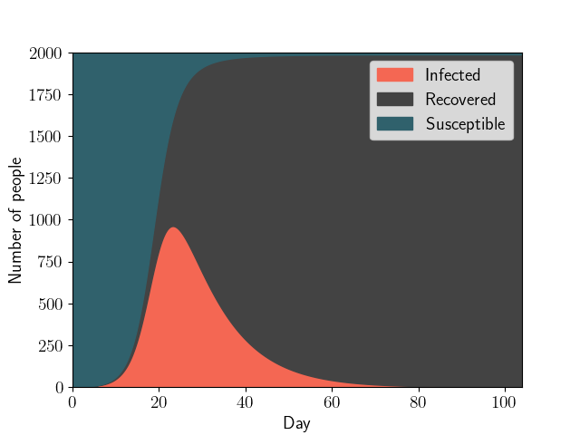
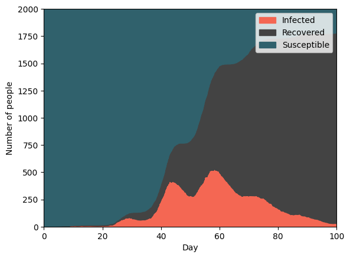

Various approaches to modeling the spread of epidemics, in particular COVID-19, are studied: the classical SIR model as a system of ordinary differential equations, and its stochastic counterpart formulated as a model of stochastic chemical kinetics, where infections and recoveries are Markov jump processes. The models are fitted to observed case counts and used to reproduce several consecutive epidemic waves.

Joint work with Peter Babkin, Nikita Kiselev, Matvei Kreinin and Maria Nikitina, December 2023.

