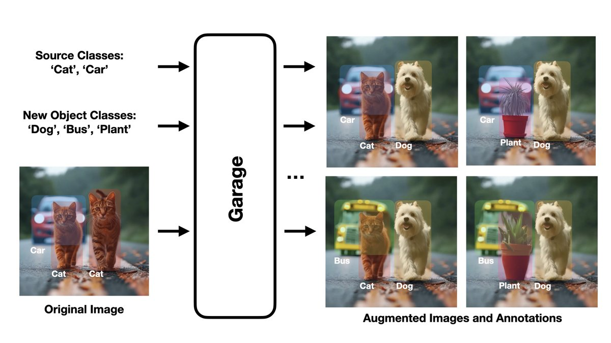

Classical augmentation changes pixels; Garage changes *content*. Given an image and a target object, it produces new training samples where that object is swapped for a plausible alternative, keeping the scene intact.

## Pipeline

1. **Grounding DINO + Segment Anything** locate the object from a text query and produce a mask.
2. The **Augmenter** model generates candidate replacement objects and prompts.
3. **PowerPaint** inpaints the masked region with the new object.

A Gradio demo lets you try it in the browser; the repository includes depth-conditioned examples and scripts to download the required checkpoints.
