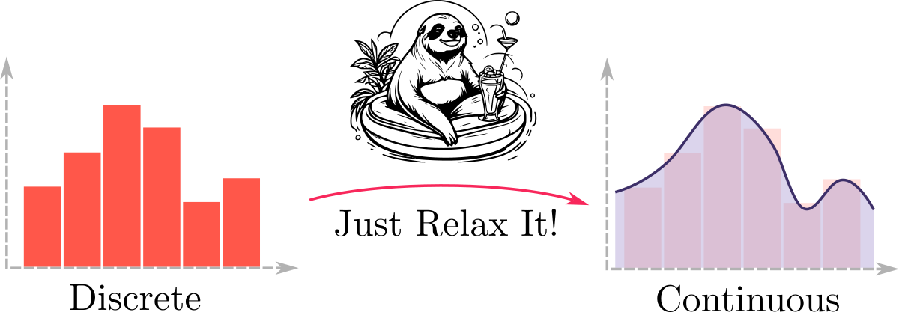

Sampling discrete random variables inside a neural network breaks gradient flow. The usual fix, Gumbel-Softmax, is only one of many relaxations. `relaxit` collects the alternatives in a single PyTorch-compatible package with a distribution interface modelled on `torch.distributions` and Pyro.

## Implemented distributions

- Relaxed Bernoulli and Correlated Relaxed Bernoulli
- Gumbel-Softmax Top-K and Generalized Gumbel-Softmax
- Straight-Through Bernoulli, Stochastic Times Smooth
- Invertible Gaussian with a closed-form KL
- Hard Concrete
- Logistic-Normal and a Laplace-form approximation of the Dirichlet
- REBAR

The repository ships with tests, coverage, a demo notebook with VAE experiments on MNIST, and a technical report. Built within the Bayesian Multimodeling course at MIPT.
