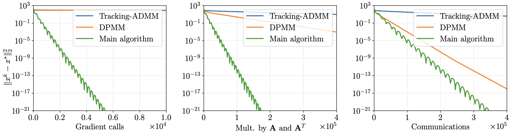

We consider the decentralized minimization of a separable objective $\sum_{i=1}^{n} f_i(x_i)$, where the variables are coupled through an affine constraint $\sum_{i=1}^n\left(\mathbf{A}_i x_i - b_i\right) = 0$. We assume that the functions $f_i$, matrices $\mathbf{A}_i$, and vectors $b_i$ are stored locally by the nodes of a computational network, and that the functions $f_i$ are smooth and strongly convex. This problem has significant applications in resource allocation and systems control and can also arise in distributed machine learning. We propose lower complexity bounds for decentralized optimization problems with coupled constraints and a first-order algorithm achieving the lower bounds. To the best of our knowledge, our method is also the first linearly convergent first-order decentralized algorithm for problems with general affine coupled constraints.

