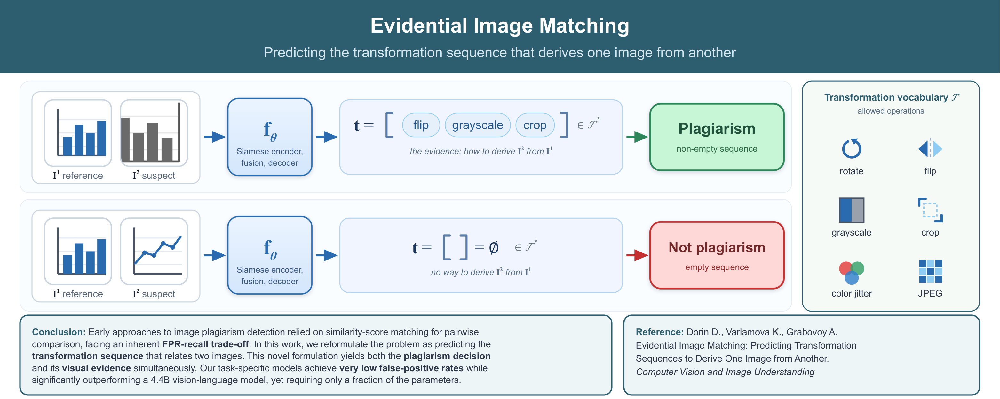

Detecting image plagiarism and near-duplicate content remains a critical challenge in academic publishing, media verification, and e-commerce. Existing methods typically rely on pairwise similarity scores, which provide limited interpretability and often struggle to distinguish visual similarity from true transformational derivability. To address this limitation, we reformulate the problem as *evidential image matching*: given a reference image and a suspect image, the model predicts the sequence of transformations that derives one image from the other. An empty sequence indicates non-plagiarism. We propose an encoder-decoder architecture trained to recover transformation sequences from a predefined vocabulary. We further introduce the Canonical Jaccard Index, a reconstruction metric that accounts for equivalent transformation sequences by respecting the algebraic structure of the dihedral group D₄ and the permutation invariance of commutative operations. Experiments on DomainNet and a curated multi-domain negative dataset show that the proposed approach substantially outperforms similarity-based baselines and a strong zero-shot vision-language model in both plagiarism detection and transformation reconstruction. In addition to improved accuracy, the model provides a human-readable evidence trail explaining its decisions.

