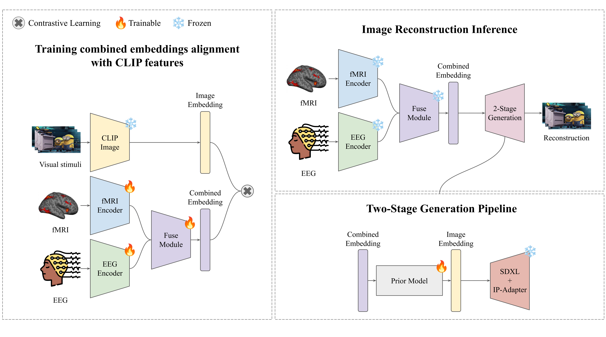

Reconstructing visual stimuli from neural signals is a fundamental challenge in neurodecoding, lying at the intersection of computational neuroscience and modern machine learning. Despite recent advances achieved using contrastive representations and diffusion-based generative models, most existing approaches are limited to a single neuroimaging modality — either functional magnetic resonance imaging (fMRI) with high spatial resolution, or electroencephalography (EEG) with high temporal resolution. The integration of both modalities remains a largely unexplored area. In this work, a multimodal architecture is proposed that jointly processes fMRI and EEG signals to reconstruct visual stimuli. Brain activity embeddings are trained contrastively to align with CLIP image embeddings. The proposed two-stage generation pipeline comprises synthesis of an intermediate latent representation via a prior model trained on joint fMRI–EEG vectors, followed by decoding this representation using a pretrained diffusion model conditioned on CLIP embeddings. Experiments on a publicly available multimodal dataset demonstrate the efficacy of the proposed architecture for neural decoding. Quantitatively, the multimodal model surpasses unimodal baselines in terms of CLIP-Score, underscoring the importance of jointly leveraging fMRI and EEG signals for accurate visual stimulus reconstruction.

