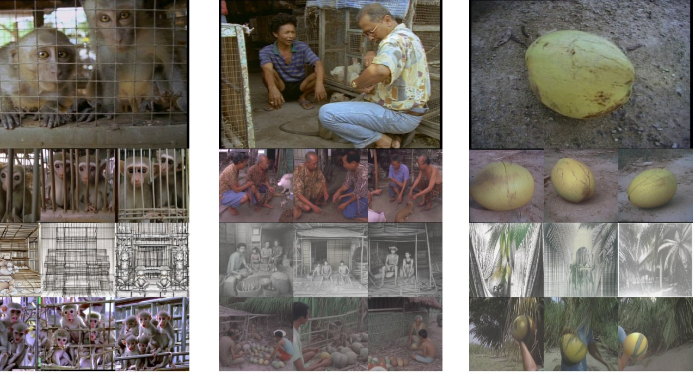

Most brain-to-image methods use a single modality. fMRI gives fine spatial detail but samples slowly; EEG is fast but spatially blurry. This work reads **both at once**.

Separate fMRI and EEG encoders produce brain embeddings that are trained contrastively to align with CLIP image embeddings. A two-stage generator then synthesises an intermediate latent with a **diffusion prior** trained on the joint fMRI–EEG vectors, and decodes it with a pretrained diffusion model (SDXL with IP-Adapter) conditioned on CLIP.

<figure class="fig">
<svg viewBox="0 0 900 250" width="100%" role="img" aria-label="fMRI-EEG decoding pipeline" style="max-height:260px;font-family:Inter,sans-serif">
  <defs><marker id="ah" markerWidth="8" markerHeight="8" refX="6" refY="4" orient="auto"><path d="M0,0 L8,4 L0,8 z" fill="var(--muted)"/></marker></defs>
  <rect x="10" y="30" width="120" height="70" rx="10" fill="var(--accent-soft)" stroke="var(--accent)"/>
  <text x="70" y="60" text-anchor="middle" font-size="14" font-weight="600" fill="var(--text)">fMRI</text>
  <text x="70" y="80" text-anchor="middle" font-size="11" fill="var(--muted)">masked voxels</text>
  <rect x="10" y="150" width="120" height="70" rx="10" fill="var(--accent-soft)" stroke="var(--accent)"/>
  <text x="70" y="180" text-anchor="middle" font-size="14" font-weight="600" fill="var(--text)">EEG</text>
  <text x="70" y="200" text-anchor="middle" font-size="11" fill="var(--muted)">temporal conv</text>
  <rect x="180" y="30" width="130" height="70" rx="10" fill="var(--surface)" stroke="var(--line)"/>
  <text x="245" y="70" text-anchor="middle" font-size="13" fill="var(--text)">fMRI encoder</text>
  <rect x="180" y="150" width="130" height="70" rx="10" fill="var(--surface)" stroke="var(--line)"/>
  <text x="245" y="190" text-anchor="middle" font-size="13" fill="var(--text)">EEG encoder</text>
  <line x1="130" y1="65" x2="178" y2="65" stroke="var(--muted)" stroke-width="1.5" marker-end="url(#ah)"/>
  <line x1="130" y1="185" x2="178" y2="185" stroke="var(--muted)" stroke-width="1.5" marker-end="url(#ah)"/>
  <rect x="360" y="90" width="130" height="70" rx="10" fill="var(--surface)" stroke="var(--accent)"/>
  <text x="425" y="120" text-anchor="middle" font-size="13" font-weight="600" fill="var(--text)">Joint embedding</text>
  <text x="425" y="140" text-anchor="middle" font-size="11" fill="var(--muted)">contrastive ↔ CLIP</text>
  <path d="M310,65 C340,65 340,125 358,125" fill="none" stroke="var(--muted)" stroke-width="1.5" marker-end="url(#ah)"/>
  <path d="M310,185 C340,185 340,125 358,125" fill="none" stroke="var(--muted)" stroke-width="1.5" marker-end="url(#ah)"/>
  <rect x="540" y="90" width="130" height="70" rx="10" fill="var(--surface)" stroke="var(--line)"/>
  <text x="605" y="120" text-anchor="middle" font-size="13" fill="var(--text)">Diffusion prior</text>
  <text x="605" y="140" text-anchor="middle" font-size="11" fill="var(--muted)">→ CLIP latent</text>
  <line x1="490" y1="125" x2="538" y2="125" stroke="var(--muted)" stroke-width="1.5" marker-end="url(#ah)"/>
  <rect x="720" y="90" width="170" height="70" rx="10" fill="var(--accent-soft)" stroke="var(--accent)"/>
  <text x="805" y="120" text-anchor="middle" font-size="13" font-weight="600" fill="var(--text)">SDXL + IP-Adapter</text>
  <text x="805" y="140" text-anchor="middle" font-size="11" fill="var(--muted)">reconstructed image</text>
  <line x1="670" y1="125" x2="718" y2="125" stroke="var(--muted)" stroke-width="1.5" marker-end="url(#ah)"/>
</svg>
<figcaption>Two-stage pipeline: fMRI and EEG are encoded, fused and aligned with CLIP; a diffusion prior maps the brain embedding to an image latent, which a pretrained diffusion model turns into pixels.</figcaption>
</figure>

To make the asynchronous recordings compatible, a preprocessing pipeline handles hemodynamic-delay correction, subject-specific fMRI brain masks, and spatial interpolation of missing EEG channels.

On a public multimodal dataset the joint model beats fMRI-only and EEG-only baselines on CLIP-Score, and the diffusion prior further improves semantic consistency. Ablations and cross-domain tests map where the model generalises and where it does not.

<b>Modalities</b>fMRI + EEG, jointly

<b>Alignment</b>Contrastive to CLIP image space

<b>Generation</b>Diffusion prior → SDXL decoder

<b>Result</b>Beats unimodal baselines on CLIP-Score

