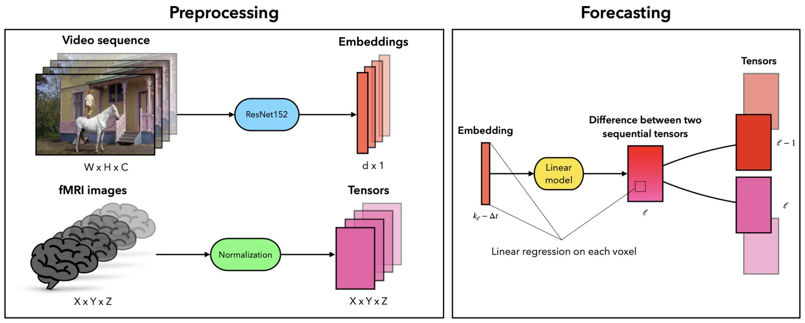

Can a linear model predict the next fMRI volume from the video a person is watching? Video frames are embedded with ResNet152 and an L2-regularised linear regression is fit **per voxel**, assuming a time-invariant hemodynamic response and a Markov property on the image sequence. The model forecasts the difference between consecutive fMRI tensors from a delayed frame embedding.

Experiments on a large multi-subject dataset show the best predictive delay is about five seconds, matching the known hemodynamic lag, and that occipital voxels respond predictably to visual content. Model weights are tested for invariance across subjects. The poster version, with voxel weighing, was shown at Neuroinformatics 2024.
