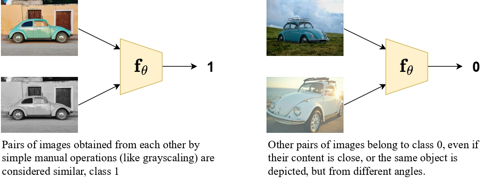
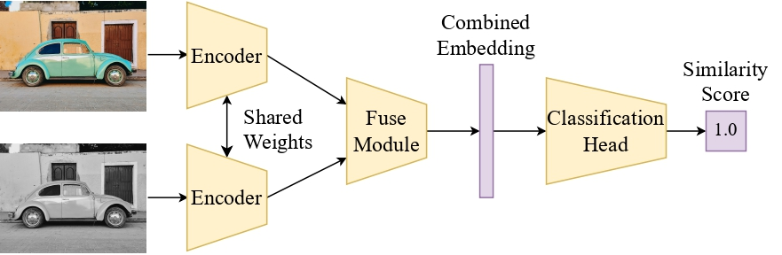

Two microscopy images of different cells can look almost identical. A grayscale, cropped copy of one figure can look quite different. Retrieval systems rank by visual similarity and get both cases wrong. We train a **Siamese network** to answer the right question: was the second image manually derived from the first?

## Architecture

- **Encoders:** EfficientNet-B3, ViT-L/16, CLIP ViT-H/14, or a Barlow Twins ResNet50. Some are kept frozen to compare our training with off-the-shelf contrastive representations.
- **Fusion:** a symmetric function of the two embeddings, so the score does not depend on input order.
- **Head:** an MLP with one hidden layer, ReLU and dropout, ending in a sigmoid that outputs the probability of a near-duplicate relation.

The system handles rotations, mirroring, grayscale conversion, contrast changes, cropping, resizing, blur, noise and their combinations. It is the matching stage of the image-search pipeline for plagiarism detection in scientific publishing.
