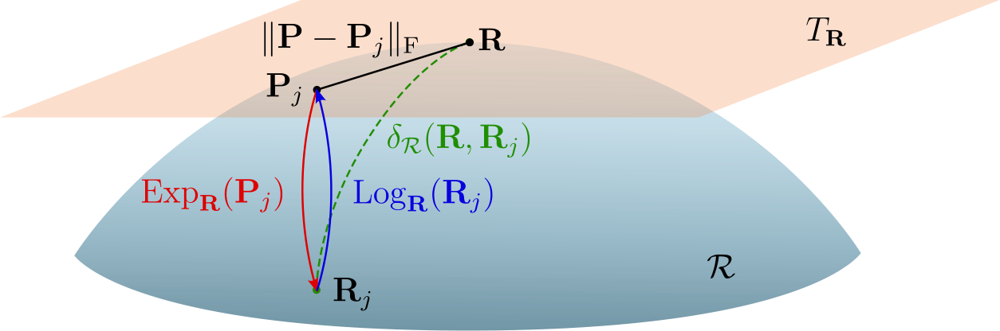

This study investigates the impact of spatiotemporal characteristics on the quality of the decoding of functional Magnetic Resonance Imaging (fMRI) data. Neural network architectures are limited in handling fMRI data due to the small sample size, high sample variability, and significant computational resources required. We propose a methodology for fMRI decoding with an insufficient dataset. We examine the unique structural features of each subject's brain. To build a decoding methodology, we propose an algorithm for extracting a unique activity mask from the brain for each subject. This algorithm reduces the spatial dimensionality of fMRI time series through weighting stimulated brain regions using cross-correlation. We developed a classification model for the fMRI time series data from a single subject. It combines two parts: the first part is the brain activity masks extracted for each activity class using the extraction algorithm. The second part is an encoder that employs Riemannian geometry to extract spatiotemporal characteristics. The computational experiment analyzes the proposed methodology on a sample obtained from tomographic examinations of six subjects. An ablation analysis of the proposed classification model shows a significant decrease in quality when any component of the model is missing. Comparisons with neural network-based approaches demonstrate the superior performance of the proposed methodology, especially in scenarios with limited data.

