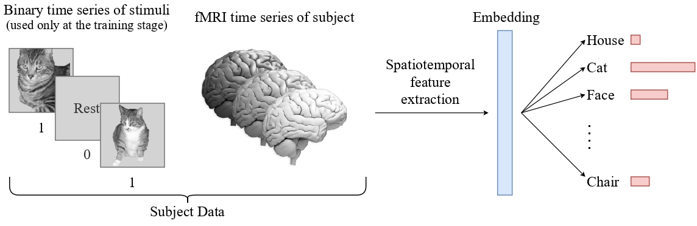
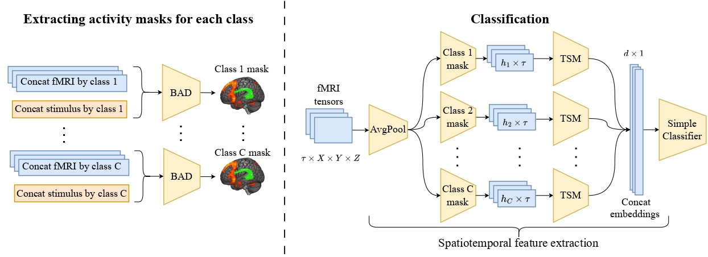

Deep networks struggle on fMRI: few samples per subject, high variability, heavy compute. This paper asks what works when data is scarce.

## Method

- **Brain Activity Decoder.** For each stimulus class, cross-correlate every voxel's time series with the stimulus timeline and keep the most responsive voxels as a binary activity mask. Masks are subject-specific and cut the spatial dimensionality by orders of magnitude.
- **Riemannian encoder.** Covariance matrices of the masked signals are mapped to the tangent space of the SPD manifold, producing spatiotemporal features that a simple classifier consumes.

## Results

On six subjects the method outperforms neural-network baselines, and the gap widens as the training set shrinks. An ablation shows a significant quality drop when either the masks or the Riemannian encoder is removed. Presented at AI Journey 2025.
